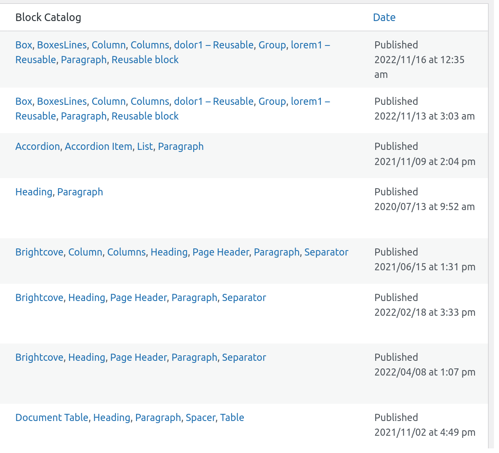

# Block Catalog

> Easily keep track of which Gutenberg Blocks are used across your site.

[](#support-level)     [](https://github.com/10up/block-catalog/blob/develop/LICENSE.md)

## Features

- Find which blocks are used across your site.
- Fully Integrated with the WordPress Admin.
- Use filters to see Posts that use a specific block.
- Find Posts that use Reusable Blocks.
- Use the WP CLI to quickly find blocks from the command line.
- Use custom WordPress filters to extend the Block Catalog.
- Find block usage on a Multisite network.
- Export block catalog data to a CSV file via the WP CLI.

## Installation

- Block Catalog can be installed like any other plugin from the [WordPress.org plugin directory](https://wordpress.org/plugins/block-catalog).
- You can also install the plugin manually by [downloading a zip file](https://github.com/10up/block-catalog/releases/latest).
- To install the plugin using [composer](https://getcomposer.org) and [wpackagist](https://wpackagist.org/), add the following to your composer.json.

```json
"wpackagist-plugin/block-catalog":"~1.3.1"
```

## Getting Started

On activation, the plugin will prompt you to index your content. You need to do this first before you will be able to see the various blocks used on your site. You can also go to _WP-Admin > Tools > Block Catalog_ to do this yourself.


Alternately, you can run the WP CLI command `wp block-catalog index` to index your content from the command line.

Once indexed, you will be able to see the different blocks used on your site in the Block Catalog Taxonomy.


Navigating to any Block Editor post type will also show you the list of blocks present in a post.



You can also filter the listing to only show Posts that have a specific block.


## WP CLI Commands

The following WP CLI commands are supported by the Block Catalog plugin.

- `wp block-catalog index [--only=<only>] [--dry-run]`
  Iterates through all posts and catalogs them one at a time.

  - [--reset]
    Deletes the previous index before starting.

  - [--only=\<only\>]
    Limits the command to the specified comma delimited post ids.

  - [--network=\<network\>]
    Indexes the entire network. Accepts a comma delimited list of child site ids.

  - [--dry-run]
    Runs catalog without saving changes to the DB.

- `wp block-catalog find <blocks>... [--index] [--fields] [--format] [--post_type] [--posts_per_page] [--post_status] [--count=<count>] [--operator=<operator>]`
  Finds the list of posts having the specified block(s)

  - \<blocks\>...
    The block names to search for, eg:- core/embed

  - [--index]
    Whether to re-index before searching.

  - [--fields=\<fields\>]
    List of post fields to display.

  - [--format=\<format\>]
    Output format, default table.

  - [--post_type=\<post_type\>]
    Limit search to specified post types.

  - [--posts_per_page=\<posts_per_page\>]
    Number of posts to find per page, default 20

  - [--post_status=\<post_status\>]
    Post status of posts to search, default 'publish'

  - [--count=\<count\>]
    Prints total found posts, default true. When combined with `--network` prints an aggregate across the multisite.

  - [--operator=\<operator\>]
    The query operator to be used in the search clause. Default IN.

  - [--network=\<network\>]
    Searches across the entire network if on multisite. Accepts a comma delimited list of child site ids.

- `wp block-catalog delete-index`
  Resets the Block Catalog by removing all catalog terms.

  - [--network=\<network\>]
    Deletes the indexes across the entire network. Accepts a comma delimited list of child site ids.

- `wp block-catalog post-blocks <post-id> [--index]`
  Prints the list of blocks in the specified post.

  - \<post-id\>
    The post id to lookup blocks for.

- `wp block-catalog export [--output=<output>] [--post_type=<types>] [--posts_per_block=<number>] [--ignore_parent=<ignore_parent>]`
  Exports the posts associated with the 'block_catalog' taxonomy to a CSV file.

  - `[--output=<output>]`
    Path to the CSV file. Defaults to `/tmp/block-catalog.csv`.

  - `[--post_type=<types>]`
    Comma-delimited list of post types. Optional.

  - `[--posts_per_block=<number>]`
    Number of posts per block, default to -1 (all). Optional.

  - `[--ignore_parent=<ignore_parent>]`
    Ignore top level blocks. Optional. Default true.

## Frequently Asked Questions

### 1) Why does the Plugin require indexing?

Block Catalog uses a taxonomy to store the data about blocks used across a site. The plugin can build this index via the Tools > Block Catalog screen or via the WP CLI `wp block-catalog index`. After the initial index, the data is automatically kept in sync after any content updates.

### 2) Why does the name displayed in the plugin use the blockName attribute instead of the title?

If your blocks are registered on the Backend with the old [register_block_type](https://developer.wordpress.org/reference/functions/register_block_type/) API, you may be missing the `title` attribute. The newer [register_block_type_from_metadata](https://developer.wordpress.org/reference/functions/register_block_type_from_metadata/) uses the same `block.json` on the FE and BE which includes the Block title.

When the plugin detects such a missing `title`, it uses the `blockName` suffix instead. eg:- xyz/custom-block will display as Custom Block.

To address this you need to update your custom block registration. If this is outside your control, you can also use the `block_catalog_block_title` filter hook to override the title as seen below.

```php
<?php

add_filter( 'block_catalog_block_title', function( $title, $block_name, $block ) {
	$map = [
		"xyz/custom-block" => "My Custom Block",
	];

	if ( ! empty( $map[ $block_name ] ) ) {
		return $map[ $block_name ];
	}

	return $title;
}, 10, 3 );

```

## Support Level

**Stable:** 10up is not planning to develop any new features for this, but will still respond to bug reports and security concerns. We welcome PRs, but any that include new features should be small and easy to integrate and should not include breaking changes. We otherwise intend to keep this tested up to the most recent version of WordPress.

## Changelog

A complete listing of all notable changes to Block Catalog are documented in [CHANGELOG.md](CHANGELOG.md).

## Contributing

Please read [CODE_OF_CONDUCT.md](CODE_OF_CONDUCT.md) for details on our code of conduct, [CONTRIBUTING.md](CONTRIBUTING.md) for details on the process for submitting pull requests to us, and [CREDITS.md](CREDITS.md) for a listing of maintainers, contributors, and libraries for Block Catalog.

## Like what you see?

<a href="http://10up.com/contact/"></a>
